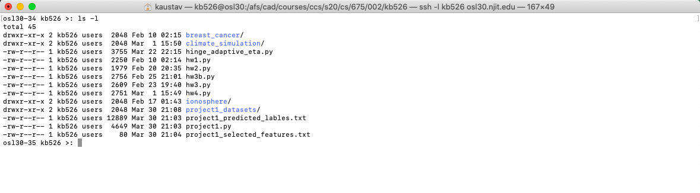
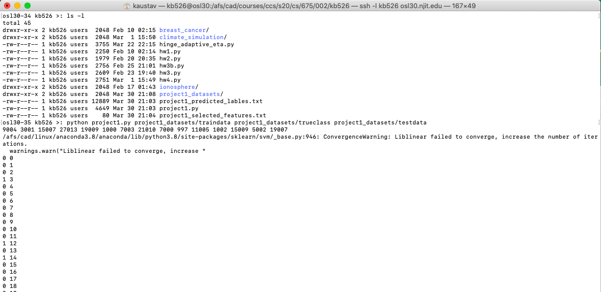

# Cancer Prediction

## Objective
In this course project we encourage you to develop your own set of methods 
for learning and classifying. 

We will test your program on the dataset provided for the project. This is 
a simulated dataset of single nucleotide polymorphism (SNP) genotype data 
containing 29623 SNPs (total features). Amongst all SNPs are 15 causal 
ones which means they and neighboring ones discriminate between case and 
controls while remainder are noise.

In the training are 4000 cases and 4000 controls. Your task is to predict 
the labels of 2000 test individuals whose true labels are known only to 
the instructor and TA. 

Both datasets and labels are immediately following the link for this
project file. The training dataset is called traindata.gz (in gzipped
format), training labels are in trueclass, and test dataset is called
testdata.gz (also in gzipped format).

You may use cross-validation to evaluate the accuracy of your method and for 
parameter estimation. The winner would have the highest accuracy in the test 
set with the fewest number of features.

Your project must be in Python. You cannot use numpy or scipy except for numpy 
arrays as given below. You may use the support vector machine, logistic regression, 
naive bayes, linear regression and dimensionality reduction modules but not the 
feature selection ones. These classes are available by importing the respective 
module. For example to use svm we do

from sklearn import svm

You may also make system calls to external C programs for classification
such as svmlight, liblinear, fest, and bmrm.

Memory issues:

One challenge with this project is the size of the data and loading it into 
RAM. Floats and numbers take up more than 4 bytes in Python because 
everything is really an object (a struct in C) that contain other 
information besides the value of the number. To reduce the space we can use 
the array class of Python.

Type 

from array import array

in the beginning of your program. Suppose we have a list of n float called 
l. This will take more space than 4l bytes. To make it space efficient 
create a new array called l2 = array('f', l). The new array l2 can be 
treated pretty much like a normal list except that it will take 4l bytes (as 
is done in C or C++).

You may also use numpy arrays for efficient storage.

Your program would take as input the training dataset, the 
trueclass label file for training points, and the test dataset. 
The output would be a prediction of the labels of the test dataset in the 
same format as in the class assignments. Also output the total number of 
features and the feature column numbers that were used for final predicton. 
If all features were used just say "ALL" instead of listing all column 
numbers.

For example your code should run like shown below:

python project1.py traindata trueclass testdata

and output would be features in the first line. For example if you picked
features 1, 10, and 15 then your first line is

1 10 15

After this line you have the predictions of the test data in the usual format
as other assignments. Below are test predictions of the first five points where
the first three are in class 0 and the last two are in class 1.

0 0
0 1
0 2
1 3
1 4

The score of your output is measured by accuracy/(#number of features). 
In order to qualify for full points you would need to achieve an accuracy
of at least 63%.

Submit your assignment by copying it into the directory
/afs/cad/courses/ccs/s20/cs/675/001/<ucid>.
For example if your ucid is abc12 then copy your Perl or Python
script into /afs/cad/courses/ccs/s20/cs/675/001/abc12.

Submit your Python program, a file containing your predicted labels, and another 
file containing your features. 

Your completed programs are due on midnight March 30th 2020. 

## How to run this program
```
python project1.py traindata trueclass testdata
```

## Proof of Submission




